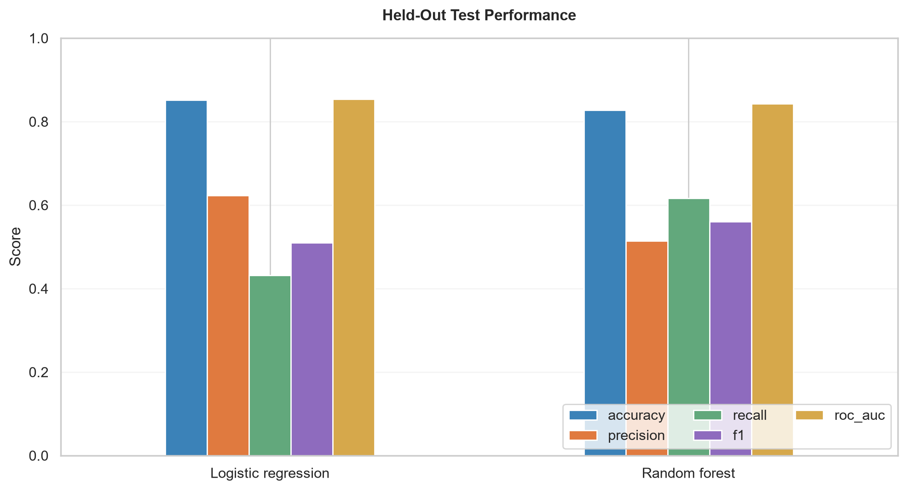
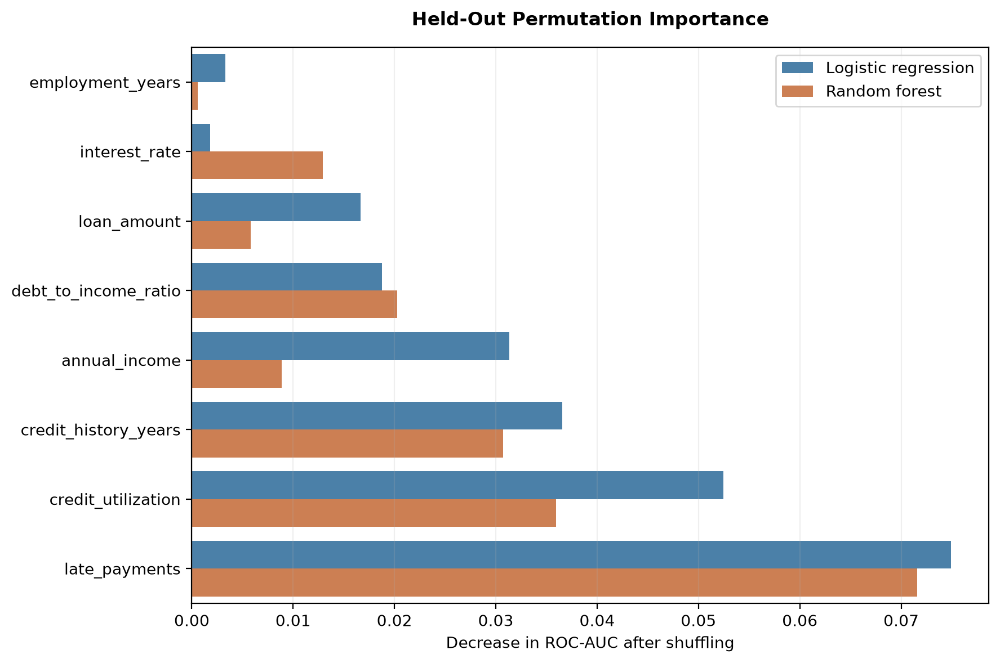

# Credit Risk Default Prediction

An end-to-end machine-learning study that generates a reproducible synthetic
financial dataset, predicts loan default, compares logistic regression with a
tuned random forest, and evaluates the effect of business decision thresholds.

> **Data disclosure:** Every applicant in this project is synthetic. The
> results demonstrate a modeling workflow; they do not establish performance
> on real borrowers and must not be used for lending decisions.

## Results

Both models were evaluated on the same untouched, stratified 20% test set
(2,000 applicants).

| Model | Accuracy | Precision | Recall | F1 | ROC-AUC | Avg. precision |
|---|---:|---:|---:|---:|---:|---:|
| Logistic regression | **85.2%** | **62.3%** | 43.1% | 0.510 | **0.854** | **0.618** |
| Random forest | 82.8% | 51.4% | **61.6%** | **0.561** | 0.843 | 0.577 |

Logistic regression produced the stronger ranking performance. The
class-balanced random forest detected more defaults at the standard 0.50
threshold but generated more false alerts.



Permutation importance identified late-payment history as the leading
predictor for both models, followed by credit utilization and credit-history
length.



## Business-threshold analysis

The default 0.50 classification threshold is not automatically the best
business decision. Under an illustrative assumption that a missed default
costs five times as much as a false alert, thresholds were selected using
out-of-fold predictions from the training set:

| Model | Selected threshold | Test recall | Test precision | Test F1 |
|---|---:|---:|---:|---:|
| Logistic regression | 0.16 | **79.3%** | 40.8% | **0.539** |
| Random forest | 0.36 | 77.6% | 40.5% | 0.532 |

The held-out test set was not used to select these thresholds.

## Dataset

The generator creates 10,000 fictional applicants with an observed default
rate of 17.86%. A fixed random seed makes the output reproducible.

| Feature | Description |
|---|---|
| `annual_income` | Yearly income in US dollars |
| `debt_to_income_ratio` | Debt payments relative to income |
| `credit_utilization` | Share of available revolving credit used |
| `late_payments` | Recent late-payment count |
| `credit_history_years` | Length of established credit history |
| `loan_amount` | Requested loan principal |
| `interest_rate` | Assigned annual interest rate |
| `employment_years` | Length of current employment |
| `default` | Binary target: 1 means default, 0 means no default |

The generator introduces correlations, nonlinear risk interactions, and
unobserved noise. The target is sampled from a probability rather than assigned
with a deterministic rule.

## Methodology

1. Generate and validate the synthetic dataset.
2. Explore class balance, distributions, and correlations.
3. Make a reproducible stratified 80/20 train-test split.
4. Train standardized logistic regression as the baseline.
5. Tune a random forest with training-only cross-validation using ROC-AUC.
6. Evaluate both models on the held-out test set.
7. Calculate permutation importance on held-out data.
8. Select illustrative business thresholds using out-of-fold training
   predictions and evaluate them on the test set.

## Reproduce the project

Requirements: Python 3.12 or a compatible modern Python release.

```powershell
python -m venv .venv
.\.venv\Scripts\python.exe -m pip install -r requirements.txt
.\run_pipeline.ps1
```

Individual stages can also be run separately:

```powershell
.\.venv\Scripts\python.exe src\generate_data.py
.\.venv\Scripts\python.exe src\explore_data.py
.\.venv\Scripts\python.exe src\train_baseline.py
.\.venv\Scripts\python.exe src\train_random_forest.py
.\.venv\Scripts\python.exe src\analyze_models.py
.\.venv\Scripts\python.exe -m unittest discover tests
```

Random-forest tuning is intentionally limited to six configurations and
three-fold cross-validation so the complete project can run on a typical
laptop.

## Project structure

```text
credit-risk-default-prediction/
├── data/                  # Synthetic dataset and EDA summary
├── images/                # Saved analysis and evaluation charts
├── models/                # Serialized fitted models
├── notebooks/             # Concise walkthrough notebook
├── results/               # Metrics, parameters, and importance tables
├── src/
│   ├── generate_data.py
│   ├── explore_data.py
│   ├── train_baseline.py
│   ├── train_random_forest.py
│   └── analyze_models.py
├── tests/
├── INTERVIEW_GUIDE.md
├── RESUME_BULLETS.md
├── requirements.txt
└── run_pipeline.ps1
```

## Limitations and responsible use

- Synthetic performance does not estimate real-world lending performance.
- The data does not represent temporal changes, economic shocks, fraud, or
  changing borrower behavior.
- Interest rate is generated partly from other risk factors, so correlated
  predictors complicate importance interpretation.
- No protected demographic attributes were generated. That prevents fairness
  auditing rather than proving the model is fair.
- The illustrative 5:1 cost ratio is not based on a real lender's economics.
- A deployed credit model would require real historical data, temporal
  validation, calibration testing, subgroup fairness analysis, monitoring,
  human review, and regulatory/legal review.

## Key tools

Python, NumPy, Pandas, scikit-learn, Matplotlib, Seaborn, Jupyter, and joblib.

